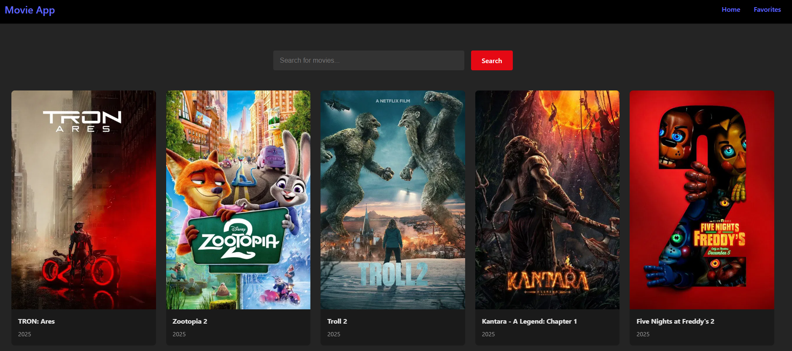

# The movie app

This application is a movie library app.

it uses React and Vite and makes use of the TMDB API.
This is an API that gives me the movies that are popular in the world. and lets me search for movies.

With this application I was aiming to refresh my knowledge on React and learn about the framework vite.
I made use of a tutorial on YouTube. And changes some little things in the CSS to flush out some details.

To run this application, you need to make sure you have Node.js installed and install vite and react, and get an IPA key from the TMDB API.
This is free, and you can get it here: https://www.themoviedb.org/documentation/api

You can then add your key to the API_KEY variable in the src/services/api.js file.
